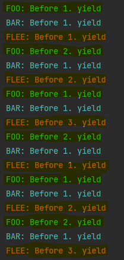

# Documentation exercise 07
###### Written by Marián Šebeňa
###### Python Interpreter 3.9
### Assigment 
You can find assigment on this  **[link](https://uim.fei.stuba.sk/i-ppds/7-cvicenie/).** 
#### Short description 
Write an application that will use N (N> 2) coprograms (using advanced generators) and use your own scheduler to rotate them. Do not use program code from the recommended literature for the solution.
### Resources
When you click on links below you will be redirected on resource web page: </br>
**[PPDS Youtube channel](https://www.youtube.com/channel/UCnTxtvNFlicb2Mn0a6w8N-A)** <br/>
**[UIM/PPDS](https://uim.fei.stuba.sk/predmet/i-ppds/)** <br/>
**[David Beazley](https://www.dabeaz.com/coroutines/Coroutines.pdf)** <br/>
**[Static variables/methods](https://www.delftstack.com/howto/python/static-class-variable-in-python/)** <br/>
**[Queue](https://www.geeksforgeeks.org/queue-in-python/)** <br/>
**[Itertools](https://www.geeksforgeeks.org/python-itertools/)** <br/>

##### Experiment with directories
First idea was implement scheduler with ordered dictionary instead of queue. Where key would be task priority and value would be a task.
In my opinion in our small program it should execute correctly but after finding positives of queue mentioned below, we decide to use it

##### Solution with queue 
After study of professional literature mentioned in the sources, we decide to use queue because of the easiest implementation.
Queue contains methods like <b> task done </b> that indicate that a formerly enqueued task is complete. And there is difference between literature code and ours. 
So we don't have to use taskmap

As first, we created three coroutines each with different number of yields to test our scheduler. 
Foo(2 yields), Bar(1 yield) and Flee(3 yields). 

In our scheduler we create new instance of task(wrapper for our coroutines) and send it to schedule. After schedule place of
task in a queue. Then mainloop manage tasks in queue, runs them, done task and reschedule for next correct execution(To next yield). At the end we create 
exception to secure correct run after generator exhaustion. Our scheduler we can see on code below.


```
class Scheduler(object):
    def __init__(self):
        self.tasks_queue = Queue()

    def new(self, cor):
        new = Task(cor)
        self.schedule(new)

    def schedule(self, task):
        self.tasks_queue.put(task)

    def mainloop(self):
        while True:
            try:
                task = self.tasks_queue.get()
                task.run()
                self.tasks_queue.task_done()
                self.schedule(task)
            except StopIteration:
                continue
```


As we can see in our highlighted print after each yield coroutine will pass the execution of the following

##### Example print

. 
