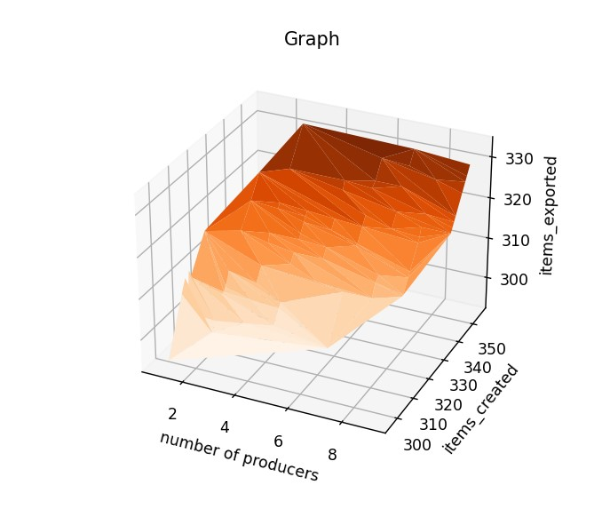
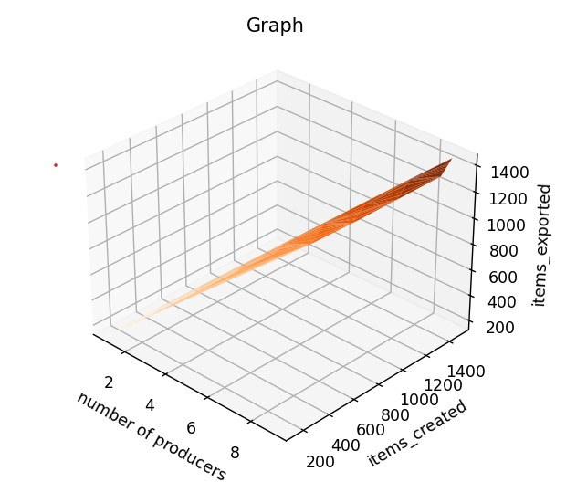
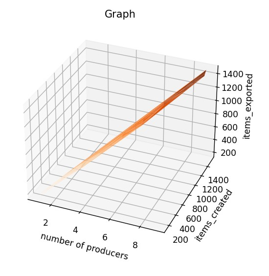

# Documentation exercise 03  
###### Written by Marián Šebeňa
###### Python Interpreter 3.9
### Assigment 
You can find assigment on this  **[link](https://uim.fei.stuba.sk/i-ppds/3-cvicenie-fibonacci-vypinac-p-k-c-z-%F0%9F%92%A1/).** 
#### Short description 

### Resources
When you click on links below you will be redirected on resource web page: </br>
**[PPDS Youtube channel](https://www.youtube.com/channel/UCnTxtvNFlicb2Mn0a6w8N-A)** <br/>
**[UIM/PPDS](https://uim.fei.stuba.sk/i-ppds/2-cvicenie-turniket-bariera-%f0%9f%9a%a7/?%2F)** <br/>
### Producer Consumer
In this exercise We firstly test program from lecture. We created variable storage in class shared
to check how access of threads in objects of this class. When producer produced an item variable storage 
incremented by 1 and when consumer took an item storage decremented by 1. We tested a lot of variations number of
producer a consumer and control which thread has already accessed to object Shared. Question was why the threads
accessed differently in time. In my opinion because of competitive execution.

##### Comparison of producer and consumer
As we can see first sleep just simulate time when item is creating. Then
producers threads wait to access into storage when they could take a mutex
to be sure that nobody(instead current thread) is in the storage. Save item in
storage and unlock mutex. 
```
def producer(shared):
    while True:
        sleep(randint(1, 10)/10)
        shared.free.wait()
        if shared.finished:
            break
        shared.mutex.lock()
        sleep(randint(1, 10) / 100)
        shared.storage += 1
        shared.mutex.unlock()
        shared.items.signal()
```
```
def consumer(shared):
    while True:
        shared.items.wait()
        shared.items_exported += 1
        if shared.finished:
            break
        shared.mutex.lock()
        shared.storage -= 1
        shared.mutex.unlock()
        shared.free.signal()
        sleep(randint(1, 10) / 250)
```

#### Experiment 1: Comparison of created and produced items with differnt number of producers and consumers

In first experiment we tested different values of producers and consumers
with constant production and exportation time. Size of storage was 10 items
###### Test 1: Rising number of producers with same size of consumers
In the first example we can see that best parameters was 2 producers and 2 consumers. When the
number of producers and consumers grows fewer items was created, reason why is probably size of 
storage when no more producers(with comparison of 2 consumers) were needed.


###### Test 2: Producers are double sized than consumers 
In the second example we could see that much more items were produced and exported than
in first testing. In my opinion it is because this ratio is really near to optimum.


###### Test 3: Producers are triple sized than consumers 
Surprisingly the third testing was pretty same as second. 
At first glance, we could not say why, but after more careful thought, we concluded that 
this may be due to the fact that consumers did not manage to export items fast enough




