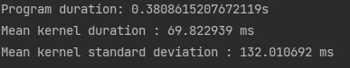

# Documentation exercise 10
###### Written by Marián Šebeňa
###### Python Interpreter 3.9
### Assigment 
You can find assigment on this  **[link](https://uim.fei.stuba.sk/i-ppds/9-cvicenie-cuda-pomocou-numba/).** 
#### Short description 
Modify the program from last week so that 1) you make optimal use of the device and 2) you use currents in the solution. Use events to measure time calculations.
### Resources
When you click on links below you will be redirected on resource web page:  
**[PPDS Youtube channel](https://www.youtube.com/channel/UCnTxtvNFlicb2Mn0a6w8N-A)**  
**[UIM/PPDS](https://uim.fei.stuba.sk/predmet/i-ppds/)**  
**[Read image as array](https://www.delftstack.com/howto/matplotlib/matplotlib-imread-in-python/)**  
**[NTSC formula](http://support.ptc.com/help/mathcad/en/index.html#page/PTC_Mathcad_Help/example_grayscale_and_color_in_images.html)**  
**[Matplotlib using examples](https://www.delftstack.com/howto/matplotlib/matplotlib-imread-in-python/)**  
**[Cuda Numba](https://www.delftstack.com/howto/matplotlib/matplotlib-imread-in-python/)**  
###### Note (Image sizes in documentation are different because we used snipping tool)
##### Program to optimization
We take previous week program, where we converted image from RGB to Grayscale. Example you can see in
branch 09 (grayscale_on_gpu.py). We can remind that the time lasted about 0.6 sec.

##### Optimized program 
Firstly in previous assignment we did not solve synchronization, 
because it was done automatically after each operation on the graphics card.

Firstly we split our image array into 4/6/8 smaller arrays. Original image size is
2400x3800. So now we have 400x3800 6times. Than we create for each smaller array one stream:
6 arrays - 6 streams. Now copying and executing kernels is asynchronous(on each stream).

##### Time measurement by events
"Events can be used to monitor the progress of execution and to record the timestamps of specific 
points being reached. Event creation returns immediately, and the created event can be queried to 
determine if it has been reached." From Cuda Numba documentation.

So we implemented time measurement from Cuda Numba documentation and lecture. We measure time for each stream
by events and results you can see below in example prints and comparisons.

##### Example prints and comparisons 
Original image

Converted image
 

Speed comparison

When we split our image array to 6 smaller and run program asynchronous with streams.
We reach 36% better time(0.6 synchronous to 0.38 asynchronous). In fact speed difference could 
be higher if we have more operations to execute.

