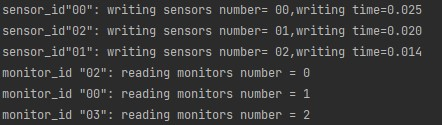

# Documentation exercise 04
###### Written by Marián Šebeňa
###### Python Interpreter 3.9
### Assigment 
You can find assigment on this  **[link](https://uim.fei.stuba.sk/i-ppds/4-cvicenie-vecerajuci-filozofi-atomova-elektraren-%f0%9f%8d%bd%ef%b8%8f/).** 
#### Short description 
The nuclear power plant has 3 sensors:

one primary circuit coolant flow sensor (sensor P)<br/>
one primary circuit coolant temperature sensor (T sensor)<br/>
one control rod insertion depth sensor (sensor H)<br/><br/>
These sensors are constantly trying to update the measured values. They store the data in a common data repository. Each sensor has its own dedicated space in the storage, where it stores data (take into account when synchronizing).

The sensors update every 50-60 ms. The data update itself takes 10-20 ms for sensor P and T for sensor T, but it takes 20-25 ms for sensor H.

In addition to the sensors, there are eight operators in that power plant, who constantly look at each of their monitors, where the measured values ​​of the sensors are displayed. The data update request is sent by the monitor continuously and continuously in a cycle. One update takes 40-50 ms.

Monitors can only start working if all sensors have already delivered valid data to the repository.
### Resources
When you click on links below you will be redirected on resource web page: </br>
**[PPDS Youtube channel](https://www.youtube.com/channel/UCnTxtvNFlicb2Mn0a6w8N-A)** <br/>
**[UIM/PPDS](https://uim.fei.stuba.sk/i-ppds/2-cvicenie-turniket-bariera-%f0%9f%9a%a7/?%2F)** <br/>

### Nuclear power station no.1
First implementation of nuclear power station we copy from lecture(available in resources). We have 11 sensors two primary circuit coolant flow sensors,
two secondary circuit coolant flow sensors, two primary circuit coolant temperature sensors,
two secondary circuit coolant temperature sensors, three control rod insertion depth sensors. These sensors actualize
values in common storage. Actualization takes from 10ms to 15ms.

Next we have two monitors who projected measured values of the sensors in every 500ms.
Every object is represented by instance of Lightswitch class as one thread. 

Sensor threads have access to storage, but they have to cross turnstile(first used synchronization object). Sensor take
a lock (access to storage) then writes values into storage(simulated by sleep function) and release a lock. This process
is repeating until monitor lock turnstile. This situation occurs when valid data are in storage and
elapsed at least 500ms from monitor last actualization. When turnstile is closed monitor takes a lock of the storage and release
turnstile. In this case sensor threads can cross the turnstile but can't access the storage because monitor owns locks.
When monitors job is done, he releases a lock and sensors have access to storage and whole process repeats.

Lock method in Lightswitch is managed to return actual number of accessing sensors/monitors to storage

### Nuclear power station no.2
Implementation of second nuclear power station assigment is pretty similar as first one. But there
are a differences. We have only 3 sensors coolant flow sensor, coolant temperature sensor and control rod insertion depth sensor. 
First two mentioned sensors writes values in range 10-20ms. Third one in range 20-25ms. Sensors make actualization every 50-60ms.
For data projecting we have 8 monitors which are still sending a request to access in storage, but they can access only when all
sensors write data into storage. Monitor actualization takes 40-50ms. Let's see our pseudocode.
#####Pseudocode
```
FUNCTION INIT():
    //initialize sync objects
    access_data = Semaphore(1)
    turnstile = Semaphore(1)
    ls_monitor = Lightswitch()
    ls_sensor = Lightswitch()
    valid_data_h = Event()
    valid_data_p = Event()
    valid_data_t = Event()

    //create threads
    FOR monitor_id IN RANGE(0,8):
        CREATE AND RUN THREAD(monitor, monitor_id)
    FOR sensor_id IN RANGE(0,3):
        CREATE AND RUN THREAD(sensor, sensor_id)
END FUNCTION

FUNCTION MONITOR(monitor_id):
    // control if all sensors collected data
    valid_data_p.wait()
    valid_data_t.wait()
    valid_data_h.wait()

    WHILE TRUE:
        // data actualization simulation
        sleep(40, 50 ms)
        
        //block turnstille so sensors in next time can't take acces to storage
        turnstile.wait()
        // get access to storage
        number_reading_monitors = ls_monitor(access_data).lock
        //release turnstile
        turnstile.signal()
        
        //simulate access to storage
        PRINT(monitor_id)
        PRINT(writing_monitors_number) 
        
        //leave storage  
        ls_monitor.unlock(access_data)
    END WHILE
END FUNCTION

FUNCTION sensor(sensor_id):
    WHILE TRUE:
        // time to next actualization
        sleep(50, 60 ms)
       
       //turnstile cross
        turnstile.wait()
        turnstile.signal()
        
        //access to storage
        number_writing_sensors = ls_sensor(access_data).lock

        //control which sensor is already there and adapt writing time
        IF control_rod_insertion_depth_sensor:
            writing_time = (20, 25 ms)
        ELSE:
            writing_time = (10, 20 ms)

        //simulate access to storage
        PRINT(sensor_id)
        PRINT(writing_sensors_number)   
        PRINT(writing_time)      
       
        // actualization time
        sleep(writing_time)

        // after when all sensors collects data monitor could continue
        IF control_rod_insertion_depth_sensor:
            valid_data_h.signal()
        IF coolant temperature sensor:
            valid_data_t.signal()
        IF coolant flow sensor:
            valid_data_p.signal()
        
        //release storage
        ls_sensor.unlock(access_data)
    END WHILE
END FUNCTION
```

Important information is that storage could be access only for sensors or monitors, but not in same time. 
We secure access to storage by three events, one for each sensor thread.
Monitor can't access storage until all sensors threads data collected. We consider that thread with id 0 is
control rod insertion depth sensor, so we set writing time to 20-25ms and then others writing time is 
in range 10-20ms. In the picture below we can see that monitors have access only when data stored. Implemented
program you can find on this [link](/nuclear_power_station_2/nuclear_power_station_2.py).

