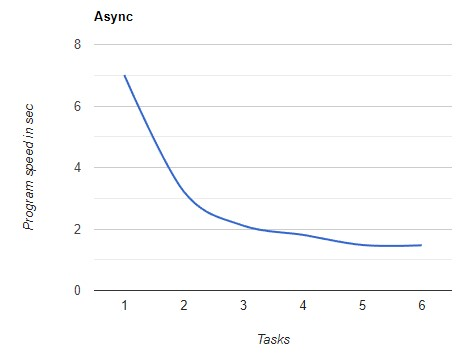
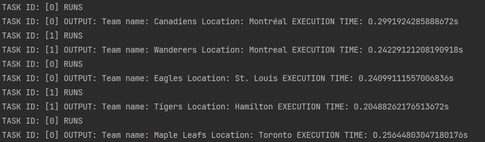
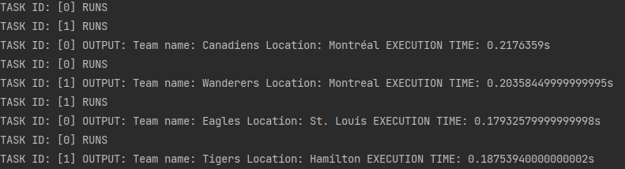

# Documentation exercise 08
###### Written by Marián Šebeňa
###### Python Interpreter 3.9
### Assigment 
You can find assigment on this  **[link](https://uim.fei.stuba.sk/i-ppds/8-cvicenie/).** 
#### Short description 
Write your own (any) single-threaded application in two versions: synchronous and asynchronous (using native routines). In the enclosed documentation, explain the purpose of the application and make a performance comparison of the synchronous and asynchronous versions. Remember to justify the results obtained (acceleration, deceleration, unchanged performance).
### Resources
When you click on links below you will be redirected on resource web page:  
**[PPDS Youtube channel](https://www.youtube.com/channel/UCnTxtvNFlicb2Mn0a6w8N-A)**  
**[UIM/PPDS](https://uim.fei.stuba.sk/predmet/i-ppds/)**  
**[Data](https://statsapi.web.nhl.com/api/v1/franchises/)**  
**[RuntimeError](https://stackoverflow.com/questions/45600579/asyncio-event-loop-is-closed-when-getting-loop)**  
**[Python JSON](https://www.w3schools.com/python/python_json.asp)**  
**[Async http requests](https://www.twilio.com/blog/asynchronous-http-requests-in-python-with-aiohttp)**  
### Data Copyright:
NHL and the NHL Shield are registered trademarks of the
National Hockey League. NHL and NHL team marks are the property of
the NHL and its teams. © NHL 2022. All Rights Reserved.

### Solution description 
In this exercise we implemented two variations of application synchronous(sync.py) and asynchronous(async.py).
Application make GET request on API, which provides NHL stats and receive JSON. We take basic data from JSON and print it
on terminal as we can see in example prints below. 

Synchronous version is trivial in for loop we call coroutine, which make GET request on url and print data.

In asynchronous version is implementation a bit complicated. We make an HTTP Request with aiohttp. Surely we have to secure
that all operations are non-blocking, because if don't our program will run synchronous. 
We are using await after each individual HTTP request in our native coroutine.

### Performance comparison
We created table of speed you can see below. When we run program synchronous speed values are cca same.
But in asynchronous speed decrease. And when we deeply see async speed values we can see certain sequence. So
we decide to plot a graph you can see below table

Num of tasks | 1 | 2 | 3 | 4 
--- | --- | --- | --- |--- 
Sync | 7.69s | 7.56s| 7.55s | 7.68s
Async | 7.01s | 3.22s | 2.11s | 1.81s 
SpeedDifference | insignificant | 2.34x | 3.58 | 4.24x 

After that we test a lot of variations with different amount of tasks in gather. From number of tasks 1 to 5 
speed decreases logarithmically and from 6 ang higher speed stagnate, so we decide to make hypothesis:

. 

With higher number of task in async programming speed decreases logarithmically after finding "optimum", than speed stagnate and no more tasks are needed.

More attempts are needed to verify this hypothesis, which is maybe wrong. But it is interesting how it works in our code. 

But we definitely prove that our async version execute faster than sync version.

### Example prints

##### Synchronous
. 
##### Asynchronous
. 
### Personal summary about asynchronous programming
In our opinion is async programming harder that sync, mainly for code readability. However, when asynchronous programming can speed up our code, it's good to know. 
At the beginning, it was a big problem for us to orient ourselves in the code, but after a more thorough reading of the literature, it improved. It is difficult to evaluate the whole thing, because we made a relatively simple application.