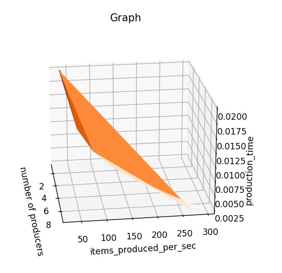

# Documentation exercise 03  
###### Written by Marián Šebeňa
###### Python Interpreter 3.9
### Assigment 
You can find assigment on this  **[link](https://uim.fei.stuba.sk/i-ppds/3-cvicenie-fibonacci-vypinac-p-k-c-z-%F0%9F%92%A1/).** 
#### Short description 
Implement the Consumer-Producer solution. Experiment with different system settings:

product production time,
product processing time,
number of consumers,
number of producers,
storage size.
Try to find out experimentally which parameters are optimal for your system. The optimality criteria should be:

Number of products produced per unit of time (in what relationship are the production time of the product, the size of the repository, the number of producers and the number of consumers?),
number of processed products per unit of time (in what relation are the processing time of the product, the size of the repository, the number of producers and the number of consumers?).
For experiments, average 10 experiment replicates at the same system settings; plot graphs for at least 100 different settings of the modeled system

### Resources
When you click on links below you will be redirected on resource web page: </br>
**[PPDS Youtube channel](https://www.youtube.com/channel/UCnTxtvNFlicb2Mn0a6w8N-A)** <br/>
**[UIM/PPDS](https://uim.fei.stuba.sk/i-ppds/2-cvicenie-turniket-bariera-%f0%9f%9a%a7/?%2F)** <br/>
**[Python Timer](https://stackoverflow.com/questions/7370801/how-to-measure-elapsed-time-in-python)** <br/>
### Producer Consumer
In this exercise We firstly test program from lecture. We created variable storage in class shared
to check how access of threads in objects of this class. When producer produced an item variable storage 
incremented by 1 and when consumer took an item storage decremented by 1. We tested a lot of variations number of
producer a consumer and control which thread has already accessed to object Shared. Question was why the threads
accessed differently in time. In my opinion because of competitive execution.

##### Comparison of producer and consumer
As we can see first sleep just simulate time when item is creating. Then
producers threads wait to access into storage when they could take a mutex
to be sure that nobody(instead current thread) is in the storage. Save item in
storage and unlock mutex. And it works very similar in consumer but storage is 
decremented.
```
def producer(shared):
    while True:
        sleep(randint(1, 10)/10)
        shared.items_produced += 1
        shared.free.wait()
        if shared.finished:
            break
        shared.mutex.lock()
        sleep(randint(1, 10) / 100)
        shared.storage += 1
        shared.mutex.unlock()
        shared.items.signal()
```
```
def consumer(shared):
    while True:
        shared.items.wait()
        shared.items_exported += 1
        if shared.finished:
            break
        shared.mutex.lock()
        shared.storage -= 1
        shared.mutex.unlock()
        shared.free.signal()
        sleep(randint(1, 10) / 250)
```
######Note: In all experiments we use grid search to find best parameters
#### Experiment 1: Comparison of created and produced items with different number of producers and consumers

In first experiment we tested different values of producers and consumers
with constant production and exportation time. Size of storage was 10 items
###### Test 1: Rising number of producers with same size of consumers
In the first example we can see that best parameters was 2 producers and 2 consumers. When the
number of producers and consumers grows fewer items was created, reason why is probably size of 
storage when no more producers(with comparison of 2 consumers) were needed.


###### Test 2: Producers are double sized than consumers 
In the second example we could see that much more items were produced and exported than
in first testing. In my opinion it is because this ratio is really near to optimum.


###### Test 3: Producers are triple sized than consumers 
Surprisingly the third testing was pretty same as second. 
At first glance, we could not say why, but after more careful thought, we concluded that 
this may be due to the fact that consumers did not manage to export items fast enough


#### Experiment 2: Addiction of produced/exported items per second and number of P/K
In the second experiment we tested how many items are produce/export per second with same production time of one item. Number of
consumers are 3 and number of producers are 1-10. On graph below we could see similarity with the first experiment when we use
small amount of consumers and rise producers size. Result describe that if producers rise with same size of consumers they are not needed.


#### Experiment 3: Addiction of item production time on items produced per second with my "optimum" ratio 2:1 of P/K
In the last experiment we test addiction between number of P/K with 2:1 ratio, produced time per second and production time of one item. 
Every next iteration we add 0.02 second to one item production time. This process was flawed, because we tested only pair
values 0.02 production time with 2:1 P:K, 0.04 sec with 4:2 P:K and so on. As we can see on the graph below plot is strongly linear.
After this finding we add random production time of one item.



In graph below we could see result after importing random produced time. And the best solution 
is logically the lowest production time which was directly moderate with created items per second. But 
surprisingly the time of production don't affect result as much as we expected. Probably when we would make
bigger time differences it will affect stronger.


