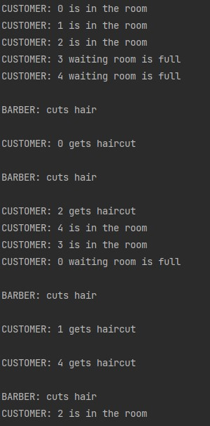

# Documentation exercise 05
###### Written by Marián Šebeňa
###### Python Interpreter 3.9
### Assigment 
You can find assigment on this  **[link](https://uim.fei.stuba.sk/i-ppds/6-cvicenie-menej-klasicke-synchronizacne-problemy/).** 
#### Short description 
Design a solution and model at least one of the synchronization issues discussed in the lecture:
barber problem
### Resources
When you click on links below you will be redirected on resource web page: </br>
**[PPDS Youtube channel](https://www.youtube.com/channel/UCnTxtvNFlicb2Mn0a6w8N-A)** <br/>
**[UIM/PPDS](https://uim.fei.stuba.sk/predmet/i-ppds/)** <br/>

### Barber problem

We implemented barber problem according to pseudocode from lecture. We have two types of threads: barber, customer.
Customer comes to waiting room if this room is full he sleeps. Then signalize(wake up) to barber that he comes. Then waits
for invitation from barber to come in. Barber takes customer in and cut his hair in the same time 
customer is getting new haircut. These two functions run competitive. As a proof of competitive run we can see
print example below when for a same time once function cut_hair ends first and once function get_haircut. After that both threads 
wait to end these functions. Barber continues with his work or wait if waiting room is empty and customer waits to grow his hair. 
##### Synchronization objects, activity timing, descriptions
We used 4 semaphores. As we mentioned previous first two secures that customer can get haircut after invitation from barber. 
Second two semaphores secure that both waits to each end his work

```
self.customer = Semaphore(0)
self.barber = Semaphore(0)

self.customer_done = Semaphore(0)
self.barber_done = Semaphore(0)

CUSTOMER PART OF CODE:

# customer signal that he is in waiting room
customer.signal() 
# waits for invitation
barber.wait()
-------------------------
# Customer signal he is satisfied with haircut
customer_done.signal()
# Waits for barber signal that haircut is complete
barber_done.wait()

BARBER PART OF CODE:

# Wait for customer 
customer.wait()
# Invite customer to get haircut
barber.signal()
-------------------------
# Wait for customer if is satisfied
customer_done.wait()
# Signal that complete hair
barber_done.signal()
```
We implemented counter for waiting room where we have actual number of customers in waiting room. Then Mutex to secure
that only one thread can modify counter in time.

Timing:

Functions cut_hair, get_haircut have similar random time because we suppose these 2 simulation last about the same. 5-10ms.

Function bulk have bigger delay because we want secure that waiting room will be free when thread come next time. 
if time be lower thread could starve. 20-25ms

At the end we implement growing_hair function 80ms to simulate time between barber visit.
##### Example print




