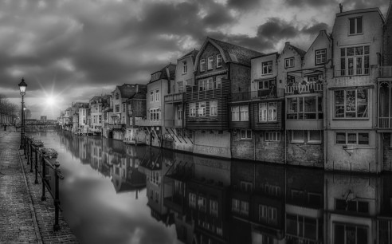

# Documentation exercise 09
###### Written by Marián Šebeňa
###### Python Interpreter 3.9
### Assigment 
You can find assigment on this  **[link](https://uim.fei.stuba.sk/i-ppds/9-cvicenie-cuda-pomocou-numba/).** 
#### Short description 
Write an own application that will use cuda for program execution.
### Resources
When you click on links below you will be redirected on resource web page:  
**[PPDS Youtube channel](https://www.youtube.com/channel/UCnTxtvNFlicb2Mn0a6w8N-A)**  
**[UIM/PPDS](https://uim.fei.stuba.sk/predmet/i-ppds/)**  
**[Read image as array](https://www.delftstack.com/howto/matplotlib/matplotlib-imread-in-python/)**  
**[NTSC formula](http://support.ptc.com/help/mathcad/en/index.html#page/PTC_Mathcad_Help/example_grayscale_and_color_in_images.html)**  

###### Note (Image sizes in documentation are different because we used snipping tool)
##### Program basic description
We implemented 3 programs. Converting from RGB to Grayscale using CPU(<b>grayscale_on_CPU.py</b>), GPU(<b>grayscale_on_GPU.py</b>)
and connect two images to one(<b>connect_two_imgs.py</b>)

##### Comparison between CPU and GPU 
Our solutions are build on easy algorithm when we replace every RGB pixel in image array by one pixel using 
NTSC formula(pixel = 0.299 * R + 0.587 * G + 0.114 * B). 

In CPU solution we simply use <b>two for cycles</b> where we iterate and replace every pixel then plot an image.

In GPU solution we use (32,32) threads per block and blocks(for x-axis and y-axis) per grid depends on size of image.
Then we run threads competitive executing and check image boundaries.

###### Time comparisons and example print
Firstly we used small image(280x180) but executing time difference was insignificant. So we decide to test it with
large image(3840x2400) and after that we could see advantage of cuda. While in CPU executing takes 72.68 seconds GPU 
takes only 0.55 second. 132x faster that is awesome.

Time execution print:

Large original image:

Large converted image:

##### Connect two pictures
We decide to make another example, which is pretty similar than previous. But we connect two pictures by RGB pixels average
value. Size of images is equal. Used pattern with each image we can see below.
    
    For one pixel
    Red_new = (img1_red + img2_red) / 2
    Green_new = (img1_green + img2_green) / 2
    Blue_new = (img1_blue + img2_blue) / 2

###### IMG 1 (team where I played football)
.
###### IMG 2 (lake where I goes for relax and fishing)
.
###### IMG 3 (Connected images)

